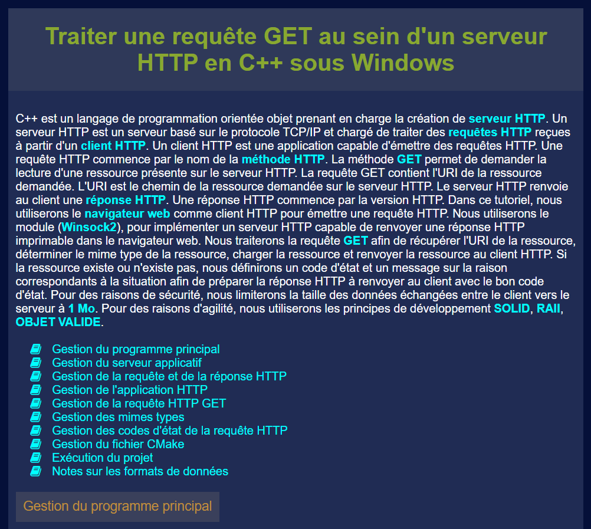

# Introduction

# Contacts

- [Site internet (ReadyDEV)](https://readydev.ovh/home/ "Accédez au site internet")
- [Tutoriels (C++)](https://readydev.ovh/home/tutoriels/cpp/cours/apprendre-cpp#traiter-une-requete-get-au-sein-d-un-serveur-http-en-c---sous-windows "Accédez aux Tutoriels")
- [Contact (LinkedIn)](https://www.linkedin.com/in/tia-gerard-kesse/ "Envoyez un message")
